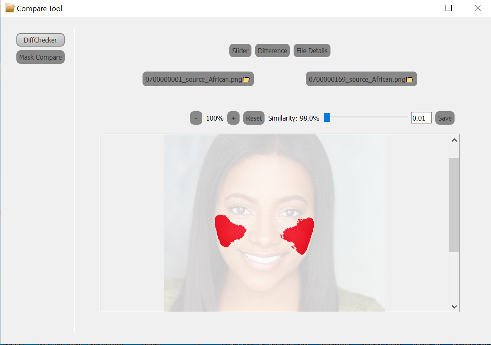
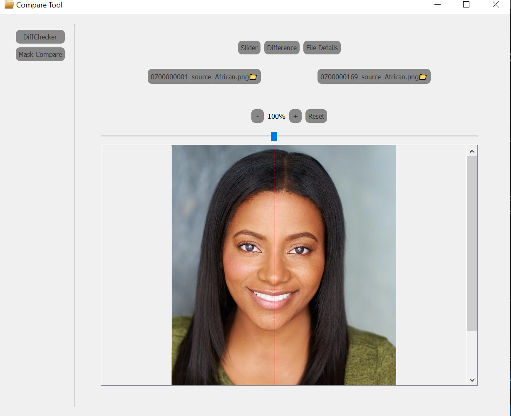
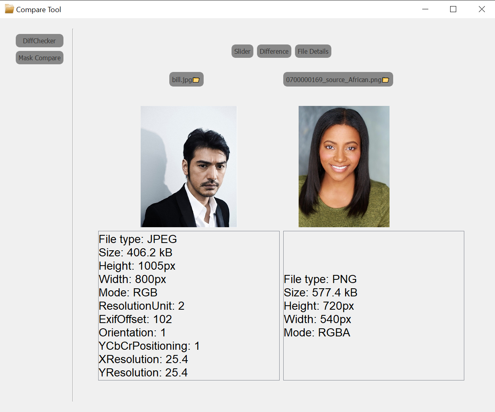

# A simple image comparison GUI tool
Using:  
Imagemagick  
PyQt  
Python

How to use:  
```
pip install -r requirements.txt 
python main.py
```
And install imagemagick:  
https://imagemagick.org/script/download.php

Features:  
⭐Compare 2 image with changable ratio and show red dot
⭐Compare 2 image with a slider bar  
⭐Compare 2 image file details




